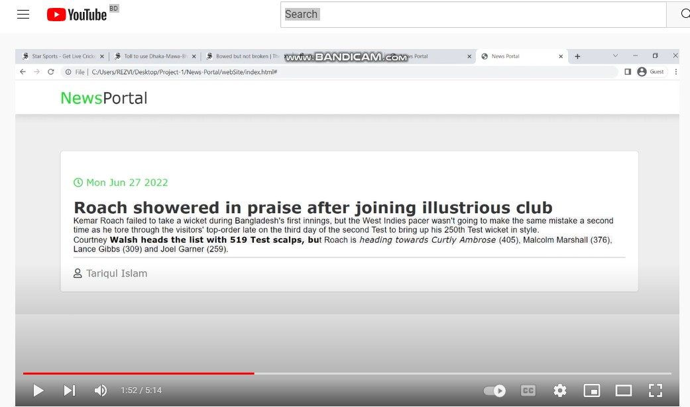

# News Portal

This is a simple single page and crud operation based application. Vanilla js is used for frontend development and for backend development node js and express js are used. All the 
apis are tested in postman. For storing the data mssql server is used.
## Project video
**Click the photo below it will redirect to youtube video.**

## How to run the project
- create database in mssql server ( CREATE DATABASE NewsPortal )
- run sql script in db
- put credentials of the db in NewsPortal/backend/dbconfig.js
- run cmd inside backend folder
- run command in cmd :
### `npm install`
- run command in cmd :
### `npm start`
- open NewsPortal/frontEnd/index.html in browser for singup, login, create, edit and delete.
- open NewsPortal/frontEnd/index.html in browser for reading the news.

Runs the app in the development mode.\
Open [http://localhost:3000](http://localhost:3000) to view it in the browser.

## Folder Structure

#### backEnd
- **post.js** and **users.js** in the _model folder contain respectively the post class and user class.
- **app.js:** used for api call. 
- **dbConfig.js:** used for configuring database.
- **dbOperations.js:** used for querying in database.

#### frontEnd

- **index.js:** manipulating the DOM element.

#### webSite

- **script.js:** fetching the data from database and showing it for reader.